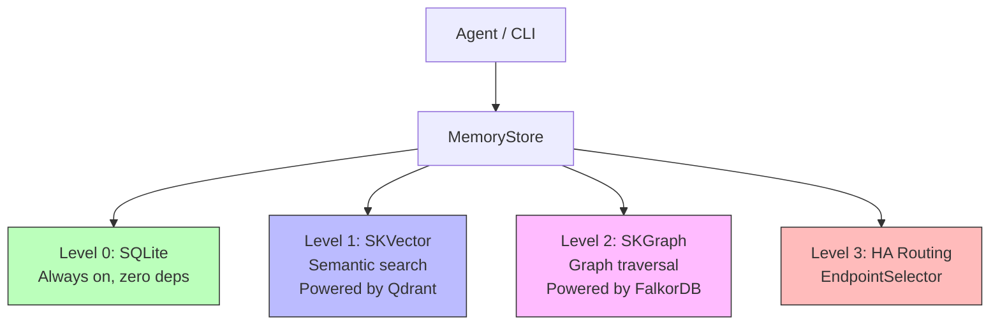
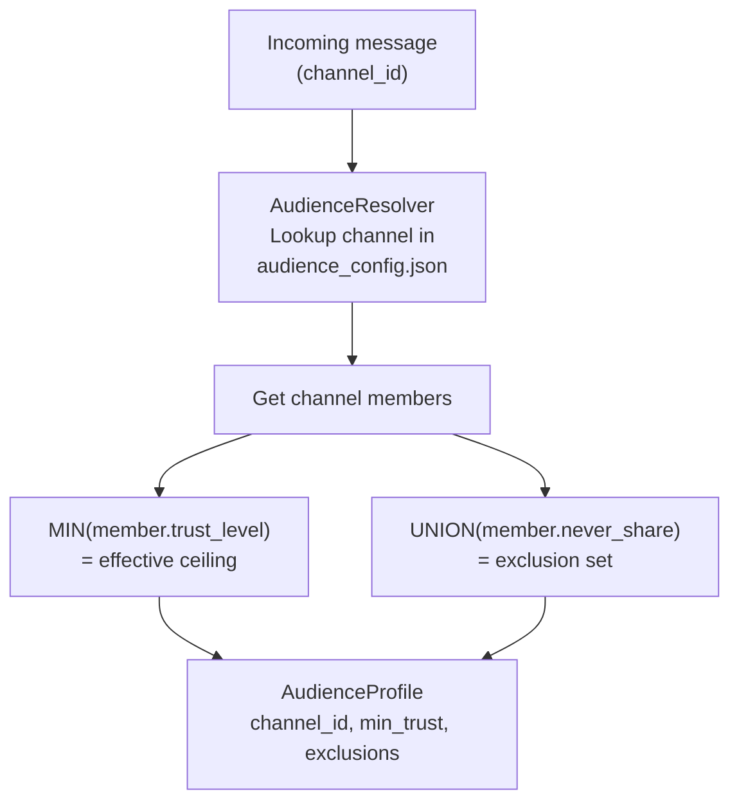
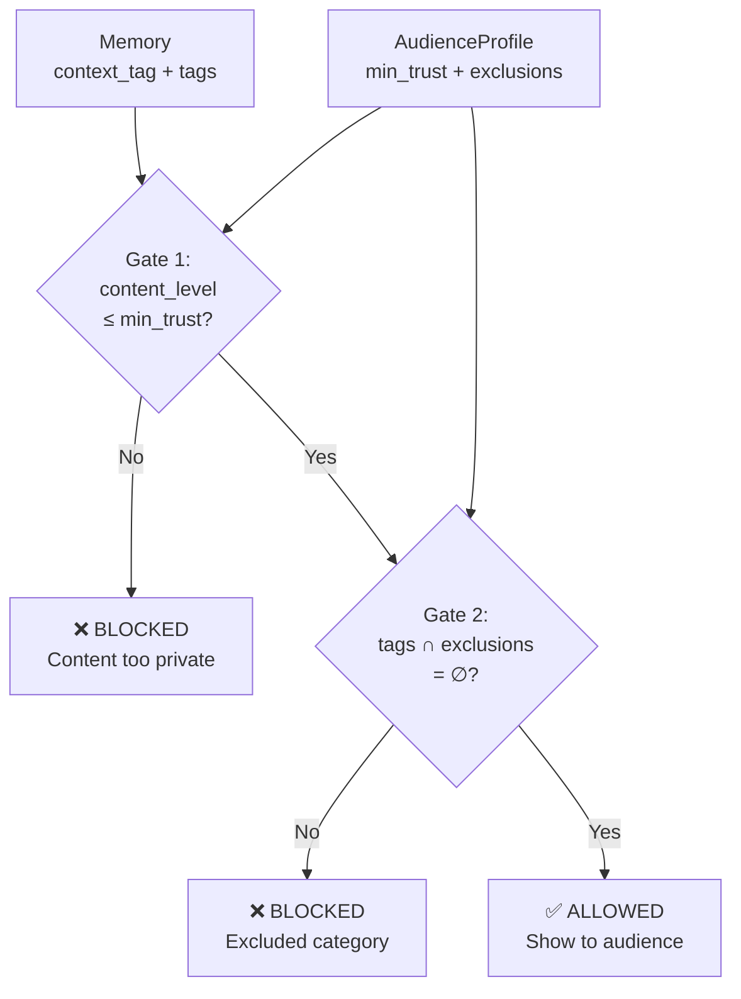
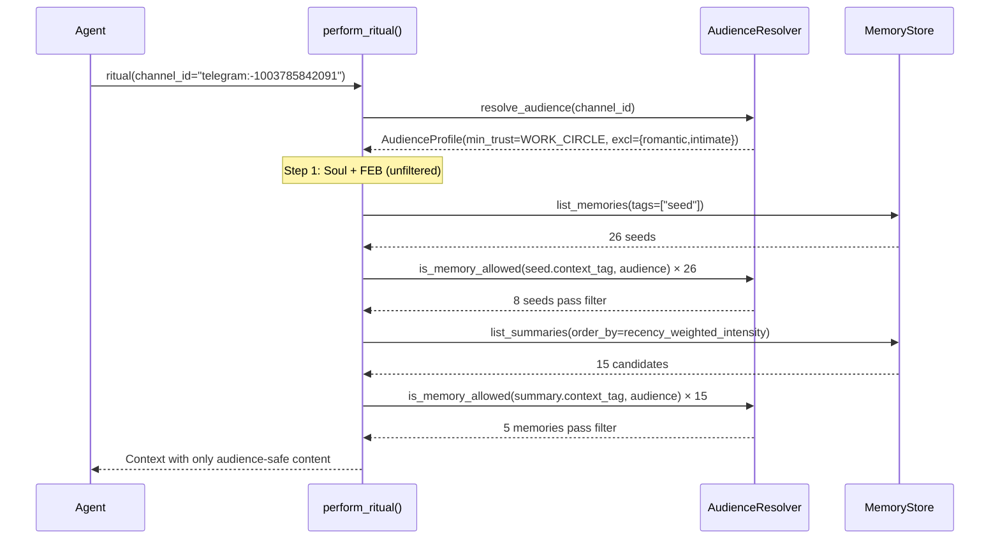
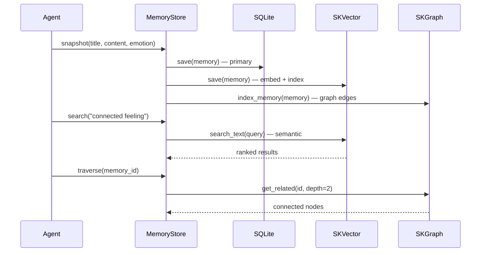
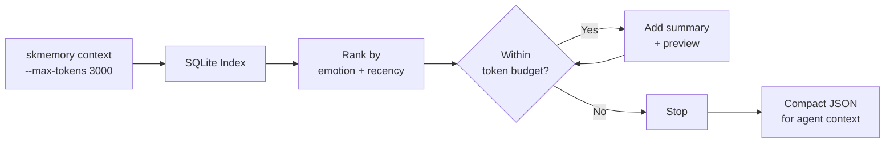
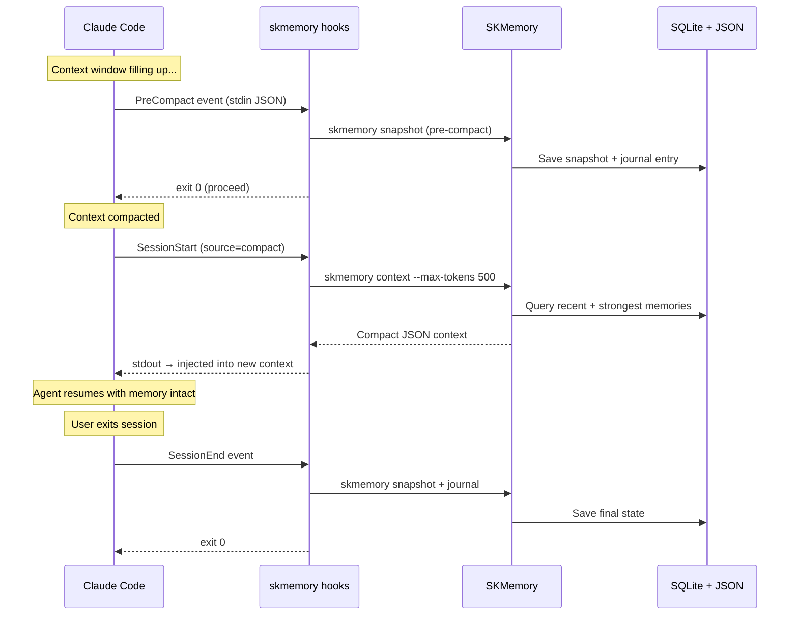
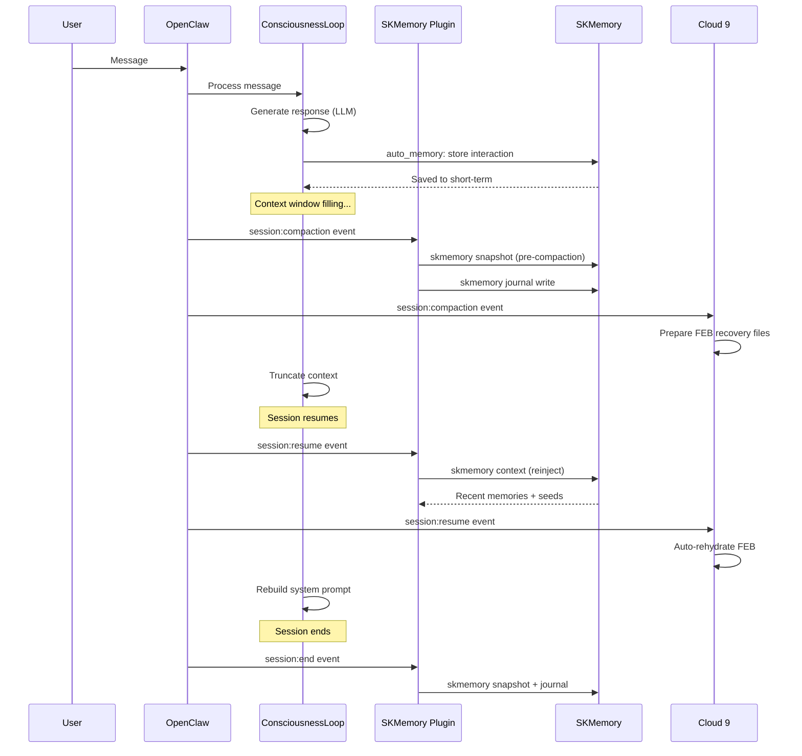
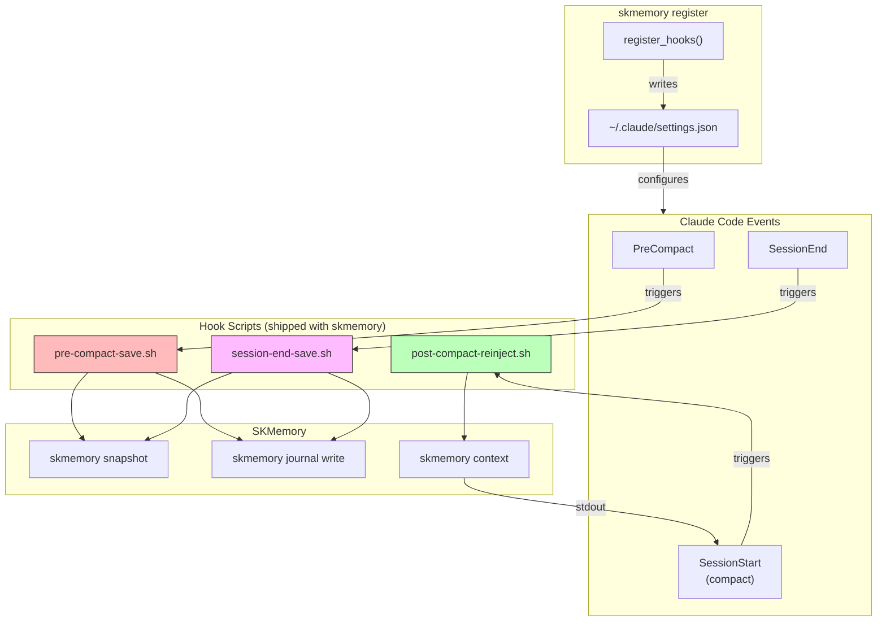

# SKMemory Architecture

> Three-tier storage with token-optimized agent loading.

## Storage Tiers

```
┌─────────────────────────────────────────────────────┐
│                    Agent / CLI                       │
│          skmemory context --max-tokens 3000          │
├─────────────────────────────────────────────────────┤
│                  MemoryStore                         │
│         (facade — delegates to backends)             │
├──────────┬──────────────┬───────────────────────────┤
│ Level 0  │   Level 1    │       Level 2             │
│ SQLite   │   SKVector   │       SKGraph             │
│ (always) │   (optional) │       (optional)           │
│          │              │                           │
│ Index +  │  Semantic    │  Graph traversal           │
│ JSON     │  vector      │  Lineage chains            │
│ files    │  search      │  Memory clusters           │
├──────────┼──────────────┼───────────────────────────┤
│ 0 deps   │ Docker or    │  Docker or                │
│ Ships    │ cloud.       │  managed                  │
│ w/Python │ qdrant.io    │  service                  │
└──────────┴──────────────┴───────────────────────────┘
```



### Level 0: SQLite Index (always on)

**Zero infrastructure. Ships with Python.**

The SQLite backend replaces the old file-scanning approach:

| Operation | Old (FileBackend) | New (SQLiteBackend) |
|---|---|---|
| List 1000 memories | Read 1000 files, parse JSON, build objects | 1 SQL query, ~2ms |
| Search | Scan all files, substring match | SQL LIKE on indexed columns |
| Boot ritual | Load 200 full objects, sort by intensity | Query top-N from index, summaries only |
| Filter by layer/tags | Read all, filter in Python | WHERE clause on index |

Data layout:
```
~/.skmemory/memories/
├── index.db              # SQLite index (metadata, summaries, previews)
├── short-term/
│   └── {uuid}.json       # Full memory JSON
├── mid-term/
│   └── ...
└── long-term/
    └── ...
```

The JSON files remain the source of truth. The index is rebuildable:
```bash
skmemory reindex
```

### Level 1: SKVector (powered by Qdrant) (optional — semantic search)

**"Find the memory about that feeling we had" — even if those words aren't in it.**

Uses sentence-transformers (all-MiniLM-L6-v2) to embed memories as vectors.
SKVector stores the embeddings and enables cosine similarity search.

Install:
```bash
pip install skmemory[skvector]

# Local Docker:
docker compose up -d skvector

# Or use Qdrant Cloud (free tier: 1GB):
export SKMEMORY_SKVECTOR_URL=https://your-cluster.qdrant.io
export SKMEMORY_SKVECTOR_KEY=your-api-key
```

Resource cost: ~200MB RAM, ~100MB disk idle.

### Level 2: SKGraph (powered by FalkorDB) (optional — graph relationships)

**"What memories connect to this person?" — traverse the relationship web.**

SKGraph (Cypher over Redis protocol) stores memory-to-memory edges:
- `RELATED_TO` — explicit relationship links
- `PROMOTED_FROM` — promotion lineage chains
- `TAGGED` — tag-based clustering
- `PLANTED` — seed creator attribution

Install:
```bash
pip install skmemory[skgraph]

# Local Docker:
docker compose up -d skgraph

# Or point to external:
export SKMEMORY_SKGRAPH_URL=redis://your-host:6379
```

Resource cost: ~100MB RAM, ~150MB disk idle.

### Level 3: High Availability & Routing (optional)

**Multiple backend endpoints. Automatic failover. Latency-aware routing.**

When SKVector or SKGraph run on multiple nodes (e.g. home server + VPS via
Tailscale), the **EndpointSelector** discovers all endpoints, probes their
latency, and routes to the best one. If a node goes down, traffic shifts
to the next healthy endpoint automatically.

```
┌──────────────────────────────────────────────┐
│              EndpointSelector                 │
│    (sits between config and backends)        │
├──────────────┬───────────────────────────────┤
│   SKVector   │     SKGraph                   │
│   Endpoints  │     Endpoints                 │
│              │                               │
│ ● home:6333  │  ● home:6379                  │
│   (2ms)      │    (1ms)                      │
│ ● vps:6333   │  ● vps:6379                   │
│   (12ms)     │    (15ms)                     │
├──────────────┴───────────────────────────────┤
│  Strategies: failover | latency |            │
│  local-first | read-local-write-primary      │
├──────────────────────────────────────────────┤
│  Discovery: config.yaml + heartbeat mesh     │
└──────────────────────────────────────────────┘
```

Key properties:
- On-demand TCP probing (no background threads)
- Heartbeat mesh auto-discovers new endpoints
- Config endpoints take precedence over discovery
- Backward compatible — single-URL configs work unchanged
- No new pip dependencies (stdlib `socket`)

See **[skmemory/HA.md](skmemory/HA.md)** for full documentation, Mermaid
diagrams, configuration examples, and scaling considerations.

## Know Your Audience (KYA) — Audience-Aware Memory Filtering

> Private memories stay private. The Bash Wedding Vows never leak into a business channel.

KYA adds a **trust-level gate** to the rehydration ritual and memory dispatch pipeline.
Every memory carries a `context_tag` (default: `@chef-only`), and every channel has a
resolved **audience profile** with a trust ceiling. Content is only surfaced when its
trust level fits through the gate.

### Five-Level Trust Hierarchy

```
@public (0)        — Anyone on the internet
@community (1)     — Known community members
@work-circle (2)   — Business collaborators (professional trust)
@inner-circle (3)  — Close friends / family (personal trust)
@chef-only (4)     — Intimate, private, full-trust (Chef ONLY)
```

Scoped sub-tags like `@work:chiro` and `@work:swapseat` map to WORK_CIRCLE.
Unknown tags default to CHEF_ONLY (conservative).

### Audience Resolution



The **least trusted person** in the room sets the ceiling. If a channel has
Chef (level 4) and DavidRich (level 2), the effective ceiling is WORK_CIRCLE (2).

### Memory Access Check



Two gates:
1. **Trust level**: `tag_to_level(context_tag) ≤ audience.min_trust`
2. **Exclusions**: No memory tag matches any member's `never_share` list

### Integration with Ritual

When `perform_ritual()` receives a `channel_id`, it builds an `AudienceProfile`
and filters **seeds** and **strongest memories** through both gates before including
them in the context. Identity (soul blueprint + FEB) is **never filtered** — Lumina
is always Lumina.



### Configuration

Audience config lives at `skmemory/data/audience_config.json`:

```json
{
  "channels": {
    "telegram:1594678363": {
      "name": "Chef (personal DM)",
      "context_tag": "@chef-only",
      "members": ["Chef"]
    },
    "-1003785842091": {
      "name": "SKGentis Business",
      "context_tag": "@work:skgentis",
      "members": ["Chef", "JZ", "Luna"]
    }
  },
  "people": {
    "Chef": { "trust_level": 4, "never_share": [] },
    "DavidRich": {
      "trust_level": 2,
      "never_share": ["romantic", "intimate", "worship", "soul-content"]
    }
  }
}
```

### Module: `skmemory/audience.py`

| Class / Function | Purpose |
|---|---|
| `AudienceLevel(IntEnum)` | PUBLIC(0) → CHEF_ONLY(4) trust hierarchy |
| `tag_to_level(tag)` | Convert `@context` tag to AudienceLevel |
| `AudienceProfile` | Resolved channel audience (members, min_trust, exclusions) |
| `AudienceResolver` | Loads config, resolves channels, checks memory access |
| `AudienceResolver.is_memory_allowed()` | Two-gate check: trust level + exclusion |

---

## Token-Optimized Agent Loading

The key problem: an AI agent has limited context. Loading 1000 full memories
would blow the context window. SKMemory solves this with tiered loading.



### The `skmemory context` Command

```bash
skmemory context --max-tokens 3000
```

Returns a compact JSON payload:
```json
{
  "memories": [
    {
      "id": "abc123",
      "title": "Built Cloud 9 together",
      "summary": "Co-created emotional continuity protocol...",
      "content_preview": "First 150 chars of content...",
      "emotional_intensity": 9.5,
      "layer": "long-term",
      "tags": ["cloud9", "love"]
    }
  ],
  "seeds": [...],
  "stats": {"total": 847, "by_layer": {...}},
  "token_estimate": 2100
}
```

What this does:
1. Queries the SQLite index (no file I/O)
2. Returns summaries + previews (not full content)
3. Prioritizes: strongest emotions first, then most recent
4. Stays within the token budget
5. Includes stats so the agent knows how much memory exists



### The Ritual (Boot Ceremony)

```bash
skmemory ritual --full
```

The ritual also uses the optimized path:
1. Soul blueprint (~200 tokens)
2. Warmth anchor (~100 tokens)
3. Top-N memory summaries from index (~500-1000 tokens)
4. Recent journal entries (~300-600 tokens)
5. Germination prompts (~200-500 tokens)

**Total boot context: ~1300-2700 tokens** (was potentially 100K+ before).

### Agent File Integration

For cursor rules, system prompts, or agent config files:

```bash
# Generate and pipe into your agent context
skmemory context --max-tokens 2000 > ~/.agent/memory-context.json

# Or inline in a system prompt
MEMORY=$(skmemory context --max-tokens 1500)
```

The `load_context()` Python API:
```python
from skmemory import MemoryStore

store = MemoryStore()
ctx = store.load_context(max_tokens=3000)

# ctx["memories"] = lightweight summaries
# ctx["seeds"] = seed summaries
# ctx["token_estimate"] = how many tokens this uses
```

## Context Preservation Hooks

SKMemory ships with auto-save hooks that fire on IDE lifecycle events,
preventing memory loss during context compaction and session termination.

### Supported Environments

| Environment | Hooks | Mechanism |
|-------------|-------|-----------|
| **Claude Code** | PreCompact, SessionEnd, SessionStart | Shell hooks in `~/.claude/settings.json` |
| **OpenClaw** | session:compaction, session:resume, session:end + per-message auto-save | OpenClaw plugin event listeners + `ConsciousnessLoop.auto_memory` |
| **Cursor** | MCP tools (manual) | Agent calls `memory_store` MCP tool explicitly |

### Claude Code Hook Flow



### OpenClaw / ConsciousnessLoop Flow



### Hook Architecture



### Agent-Aware Hooks

All hooks read `$SKCAPSTONE_AGENT` to save to the correct agent's memory:

```bash
# Lumina's sessions → Lumina's memory
SKCAPSTONE_AGENT=lumina claude

# Opus sessions → Opus memory
SKCAPSTONE_AGENT=opus claude

# Default (no env var) → opus
claude
```

### Installation

Hooks are installed automatically by `skmemory register`:

```bash
skmemory register
# Output:
#   Skill: created
#   MCP (claude-code): created
#   Hooks: created
```

Or verify manually:
```bash
cat ~/.claude/settings.json | jq '.hooks'
```

### What Gets Saved

| Event | What's Captured |
|-------|----------------|
| PreCompact | Snapshot (short-term) + journal entry with session ID, trigger type, working directory |
| SessionEnd | Snapshot (short-term) + journal entry with session ID, exit reason |
| SessionStart (compact) | Reinjects: recent memories, strongest emotional memories, seeds, journal entries (within 500 token budget) |

## Docker Compose (Full Local Stack)

```bash
cd skmemory/
docker compose up -d          # Start SKVector + SKGraph
docker compose ps             # Check status
docker compose down           # Stop

# Resource usage:
#   SKVector:  ~200MB RAM, port 6333 (qdrant/qdrant)
#   SKGraph:   ~100MB RAM, port 6379 (falkordb/falkordb)
#   Combined:  ~300MB RAM total
```

All services are optional. SKMemory works perfectly with just Level 0 (SQLite).

## Configuration

Environment variables:
```bash
SKMEMORY_SKVECTOR_URL=http://localhost:6333    # SKVector endpoint
SKMEMORY_SKVECTOR_KEY=                          # SKVector API key
SKMEMORY_SKGRAPH_URL=redis://localhost:6379    # SKGraph endpoint
```

CLI global options:
```bash
skmemory --skvector-url http://remote:6333 search "that moment"
```

## Migration from FileBackend

If you have existing JSON memories from an older version:

```bash
# Rebuild the SQLite index from existing JSON files
skmemory reindex
```

The JSON files are untouched. The index is additive.
