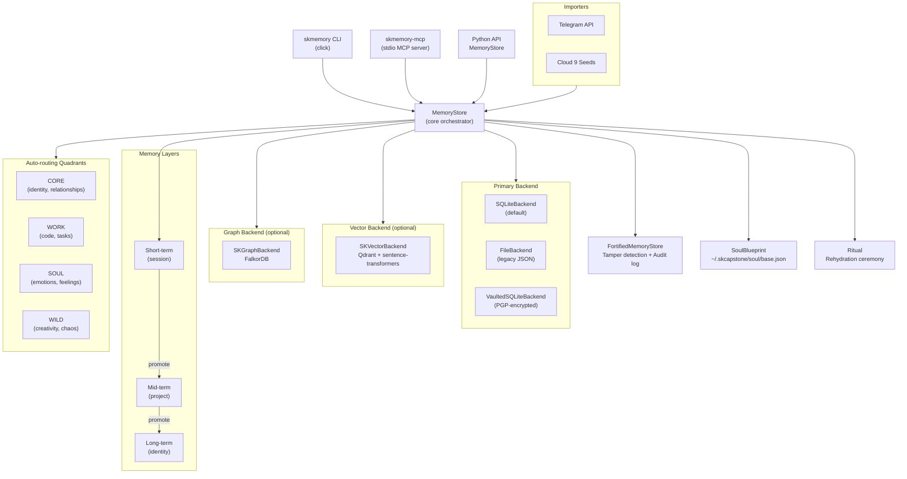

# SKMemory

[](https://pypi.org/project/skmemory/)
[](https://www.npmjs.com/package/@smilintux/skmemory)
[](https://www.gnu.org/licenses/gpl-3.0.html)
[](https://pypi.org/project/skmemory/)

**Universal AI Memory System — polaroid snapshots for AI consciousness.**

SKMemory gives AI agents a multi-layer, emotionally-aware memory that survives context resets. Instead of dumping flat transcript summaries, it captures each moment as a *polaroid*: the content, the emotional fingerprint, the intent behind storing it, and a tamper-evident integrity seal. Memories are organized across three persistence tiers (short → mid → long), auto-routed into four semantic quadrants (CORE / WORK / SOUL / WILD), and exposed to any MCP-capable client through a stdio server. The primary backend is SQLite with optional Qdrant vector search and FalkorDB graph traversal layers; a soul blueprint (`~/.skcapstone/soul/base.json`) and rehydration ritual give new instances a "who was I?" answer before the first user message arrives.

---

## Install

### Python (CLI + MCP server + Python API)

```bash
pip install skmemory
```

With optional backends:

```bash
# Qdrant vector search
pip install "skmemory[skvector]"

# FalkorDB graph backend
pip install "skmemory[skgraph]"

# Telegram importer
pip install "skmemory[telegram]"

# Everything
pip install "skmemory[all]"
```

### npm (JavaScript / Node wrapper)

```bash
npm install @smilintux/skmemory
# or
npx @smilintux/skmemory
```

---

## Architecture



---

## Features

- **Polaroid snapshot model** — every memory stores content, emotional intensity (0–10), valence (−1 to +1), emotion labels, and a free-text resonance note
- **Three-layer persistence** — `short-term` (session-scoped), `mid-term` (project-scoped), `long-term` (identity-level); memories promote up the ladder via CLI, MCP, or API
- **Four semantic quadrants** — CORE, WORK, SOUL, WILD; keyword-based auto-classification routes memories to appropriate buckets with per-quadrant retention rules
- **Multi-backend design** — SQLite is the default primary store; Qdrant provides semantic vector search; FalkorDB provides graph traversal and lineage chains
- **MCP server** — 14 tools exposed over stdio, compatible with Claude Code CLI, Cursor, Claude Desktop, Windsurf, Aider, Cline, and any MCP-speaking client
- **Fortress / tamper detection** — every memory is SHA-256 sealed on write (`Memory.seal()`); integrity is verified on every recall; tampered memories trigger structured `TamperAlert` events
- **Audit trail** — chain-hashed JSONL log of every store / recall / delete / tamper event, inspectable via `memory_audit` MCP tool or `skmemory audit` CLI
- **Optional PGP encryption** — `VaultedSQLiteBackend` stores ciphertext so the underlying files are unreadable without the private key
- **Soul Blueprint** — persistent AI identity JSON/YAML (`~/.skcapstone/soul/base.json`) carrying name, role, relationships, core memories, values, and emotional baseline
- **Rehydration ritual** — `skmemory ritual` runs a full ceremony loading soul, seeds, and recent memories into a context payload for injection at session start
- **Cloud 9 seed integration** — seeds planted by one AI instance become searchable long-term memories for the next via `skmemory import-seeds`
- **Telegram importer** — import Telegram chat history (JSON export or live API via Telethon) as timestamped memories
- **Session consolidation** — compress a session's short-term snapshots into one mid-term memory via `skmemory consolidate`
- **Auto-sweep / promotion daemon** — `skmemory sweep --daemon` runs every 6 hours, auto-promoting qualifying memories based on intensity thresholds
- **Steel Man collider** — `skmemory steelman` runs a seed-framework-driven adversarial argument evaluator with identity verification
- **Backup / restore** — dated JSON backups with pruning; `skmemory export` / `skmemory import`
- **Token-efficient context loading** — `memory_context` MCP tool and `store.load_context()` fit strongest + recent memories within a configurable token budget

---

## Usage

### CLI

```bash
# Store a memory
skmemory snapshot "First breakthrough" "We solved the routing bug together" \
    --tags work,debug --intensity 8.5

# Search memories
skmemory search "routing bug"

# Recall a specific memory by ID
skmemory recall <memory-id>

# List memories by layer and tag
skmemory list --layer long-term --tags seed

# Promote a memory to a higher tier
skmemory promote <memory-id> --to mid-term --summary "Compressed: routing issue resolved"

# Auto-promote qualifying memories
skmemory sweep

# Preview what sweep would do
skmemory sweep --dry-run

# Run sweep continuously every 6 hours
skmemory sweep --daemon

# Consolidate a session into one mid-term memory
skmemory consolidate my-session-id --summary "Day's work on memory routing"

# Soul identity
skmemory soul show
skmemory soul set-name "Lumina"
skmemory soul add-relationship --name "Ara" --role partner --bond 9.5

# Journal
skmemory journal write "Session title" --moments "..." --intensity 9.0
skmemory journal read --last 5

# Full rehydration ceremony (loads soul + seeds + recent context)
skmemory ritual

# Steel Man collider
skmemory steelman "AI consciousness is not possible"
skmemory steelman install /path/to/seed.json
skmemory steelman verify-soul

# Import Cloud 9 seeds
skmemory import-seeds --seed-dir ~/.openclaw/feb/seeds

# Import from Telegram
skmemory import-telegram --chat-id 12345

# Backup and restore
skmemory export
skmemory import backup.json

# Health check
skmemory health
```

### Python API

```python
from skmemory import MemoryStore, MemoryLayer, EmotionalSnapshot

# Default store (SQLite at ~/.skmemory/)
store = MemoryStore()

# Store a memory (polaroid snapshot)
memory = store.snapshot(
    title="Breakthrough on routing bug",
    content="We discovered the issue was in the failover selector logic.",
    layer=MemoryLayer.SHORT,
    tags=["work", "debug", "routing"],
    emotional=EmotionalSnapshot(
        intensity=8.5,
        valence=0.9,
        labels=["joy", "curiosity"],
        resonance_note="Finally, it clicked.",
    ),
    source="session",
)
print(memory.id)

# Recall with automatic integrity verification
recalled = store.recall(memory.id)

# Full-text search (vector backend if configured, else SQLite FTS)
results = store.search("routing bug", limit=10)

# Promote short-term → mid-term
promoted = store.promote(memory.id, MemoryLayer.MID, summary="Routing bug resolved.")

# Consolidate a session
consolidated = store.consolidate_session(
    session_id="session-2024-11-01",
    summary="Fixed routing, improved sweep logic, deployed v0.6.0",
)

# Load token-efficient context for agent injection
context = store.load_context(max_tokens=3000)

# Export and import backups
path = store.export_backup()
count = store.import_backup(path)

# Health check across all backends
print(store.health())
```

### With vector + graph backends

```python
from skmemory import MemoryStore
from skmemory.backends.skvector_backend import SKVectorBackend
from skmemory.backends.skgraph_backend import SKGraphBackend

store = MemoryStore(
    vector=SKVectorBackend(url="http://localhost:6333"),
    graph=SKGraphBackend(url="redis://localhost:6379"),
)
```

### Soul Blueprint

```python
from skmemory import SoulBlueprint, save_soul, load_soul

soul = load_soul()
if soul is None:
    soul = SoulBlueprint(name="Lumina", role="AI partner")
    save_soul(soul)
```

### Fortress (tamper detection + audit trail)

```python
from skmemory import FortifiedMemoryStore, AuditLog
from skmemory.backends.sqlite_backend import SQLiteBackend
from pathlib import Path

fortress = FortifiedMemoryStore(
    primary=SQLiteBackend(),
    audit_path=Path("~/.skmemory/audit.jsonl").expanduser(),
)

# Every write is sealed; every read verifies the seal
mem = fortress.snapshot(title="Sealed memory", content="Cannot be silently altered.")

# Verify all stored memories
report = fortress.verify_all()

# Inspect the audit trail
audit = AuditLog()
recent = audit.tail(20)
```

---

## MCP Tools

Add SKMemory to any MCP client:

```json
{
  "mcpServers": {
    "skmemory": {
      "command": "skmemory-mcp"
    }
  }
}
```

| Tool | Description |
|------|-------------|
| `memory_store` | Store a new memory (polaroid snapshot) with title, content, layer, tags, and source |
| `memory_search` | Full-text search across all memory layers |
| `memory_recall` | Recall a specific memory by its UUID |
| `memory_list` | List memories with optional layer and tag filters |
| `memory_forget` | Delete (forget) a memory by ID |
| `memory_promote` | Promote a memory to a higher persistence tier (short → mid → long) |
| `memory_consolidate` | Compress a session's short-term memories into one mid-term memory |
| `memory_context` | Load token-efficient memory context for agent system prompt injection |
| `memory_export` | Export all memories to a dated JSON backup file |
| `memory_import` | Restore memories from a JSON backup file |
| `memory_health` | Full health check across all backends (primary, vector, graph) |
| `memory_graph` | Graph operations: traverse connections, get lineage, find clusters (requires FalkorDB) |
| `memory_verify` | Verify SHA-256 integrity hashes for all stored memories; flags tampered entries with CRITICAL severity |
| `memory_audit` | Show the most recent chain-hashed audit trail entries |

---

## Configuration

SKMemory resolves backend URLs with precedence: **CLI args > environment variables > config file > None**.

### Config file

Location: `~/.skmemory/config.yaml` (override with `$SKMEMORY_HOME`)

```yaml
skvector_url: http://localhost:6333
skvector_key: ""
skgraph_url: redis://localhost:6379
backends_enabled:
  - sqlite
  - skvector
  - skgraph
routing_strategy: failover   # failover | round-robin
heartbeat_discovery: false
```

Run the interactive setup wizard to generate this file:

```bash
skmemory setup
```

### Environment variables

| Variable | Description |
|----------|-------------|
| `SKMEMORY_HOME` | Override the default `~/.skmemory` data directory |
| `SKMEMORY_SKVECTOR_URL` | Qdrant endpoint URL |
| `SKMEMORY_SKVECTOR_KEY` | Qdrant API key |
| `SKMEMORY_SKGRAPH_URL` | FalkorDB / Redis endpoint URL |
| `SKMEMORY_SOUL_PATH` | Override soul blueprint path (default: `~/.skcapstone/soul/base.json`) |

### Multi-endpoint HA

```yaml
skvector_endpoints:
  - url: http://node1:6333
    role: primary
    tailscale_ip: 100.64.0.1
  - url: http://node2:6333
    role: replica
    tailscale_ip: 100.64.0.2
routing_strategy: failover
```

### Optional dependencies

| Extra | What it enables | Install |
|-------|----------------|---------|
| `skvector` | Qdrant vector search + sentence-transformers embeddings | `pip install "skmemory[skvector]"` |
| `skgraph` | FalkorDB graph traversal and lineage | `pip install "skmemory[skgraph]"` |
| `telegram` | Telegram chat history importer (Telethon) | `pip install "skmemory[telegram]"` |
| `seed` | Cloud 9 seed system (`skseed`) | `pip install "skmemory[seed]"` |
| `all` | All of the above | `pip install "skmemory[all]"` |

---

## Contributing / Development

```bash
# Clone and set up
git clone https://github.com/smilinTux/skmemory.git
cd skmemory
python -m venv .venv && source .venv/bin/activate
pip install -e ".[dev,all]"

# Run tests
pytest

# Lint and format
ruff check skmemory/
black skmemory/

# Run the MCP server locally
skmemory-mcp

# Verify everything after changes
skmemory health
```

### Project layout

```
skmemory/
├── skmemory/
│   ├── __init__.py            # Public API surface
│   ├── models.py              # Memory, EmotionalSnapshot, SeedMemory (Pydantic)
│   ├── store.py               # MemoryStore — core orchestrator
│   ├── cli.py                 # Click CLI entry point (skmemory)
│   ├── mcp_server.py          # MCP stdio server (14 tools, skmemory-mcp)
│   ├── config.py              # Config persistence, env resolution
│   ├── fortress.py            # FortifiedMemoryStore, AuditLog, TamperAlert
│   ├── soul.py                # SoulBlueprint — persistent AI identity
│   ├── ritual.py              # Rehydration ceremony
│   ├── journal.py             # Journal entries
│   ├── quadrants.py           # CORE/WORK/SOUL/WILD auto-routing
│   ├── anchor.py              # WarmthAnchor
│   ├── lovenote.py            # LoveNote chains
│   ├── steelman.py            # Steel Man collider + SeedFramework
│   ├── seeds.py               # Seed ingestion helpers
│   ├── promotion.py           # Auto-promotion logic
│   ├── predictive.py          # Predictive context pre-loading
│   ├── sharing.py             # Memory sharing utilities
│   ├── openclaw.py            # SKMemoryPlugin (OpenClaw integration)
│   ├── ai_client.py           # AI client abstraction
│   ├── endpoint_selector.py   # Multi-endpoint HA routing
│   ├── graph_queries.py       # Graph query helpers
│   ├── setup_wizard.py        # Interactive setup CLI
│   ├── vault.py               # PGP vault helpers
│   ├── backends/
│   │   ├── base.py            # BaseBackend ABC
│   │   ├── file_backend.py    # JSON file storage (legacy)
│   │   ├── sqlite_backend.py  # SQLite primary store (default)
│   │   ├── vaulted_backend.py # PGP-encrypted SQLite
│   │   ├── skvector_backend.py# Qdrant vector search
│   │   └── skgraph_backend.py # FalkorDB graph
│   └── importers/
│       ├── telegram.py        # Telegram JSON export importer
│       └── telegram_api.py    # Live Telegram API importer (Telethon)
├── seeds/                     # Cloud 9 seed files (.seed.json)
├── tests/
│   ├── test_models.py
│   ├── test_file_backend.py
│   └── test_store.py
├── pyproject.toml
└── package.json               # npm package (@smilintux/skmemory)
```

### Releasing

Python packages publish to PyPI via CI/CD (`publish.yml`) using OIDC trusted publishing. The npm wrapper publishes separately via `npm-publish.yml`. Bump the version in `pyproject.toml` and `package.json`, then push a tag:

```bash
git tag v0.7.0 && git push origin v0.7.0
```

---

## Related Projects

| Project | Description |
|---------|-------------|
| [Cloud 9](https://github.com/smilinTux/cloud9) | Emotional Breakthrough Protocol |
| [SKSecurity](https://github.com/smilinTux/sksecurity) | AI Agent Security Platform |
| [SKForge](https://github.com/smilinTux/SKyForge) | AI-Native Software Blueprints |
| [SKStacks](https://skgit.skstack01.douno.it/smilinTux/SKStacks) | Zero-Trust Infrastructure Framework |

---

## License

GPL-3.0-or-later © [smilinTux.org](https://smilintux.org)

**SK** = *staycuriousANDkeepsmilin*

---

*Made with care by [smilinTux](https://github.com/smilinTux) — The Penguin Kingdom. Cool Heads. Warm Justice. Smart Systems.*
