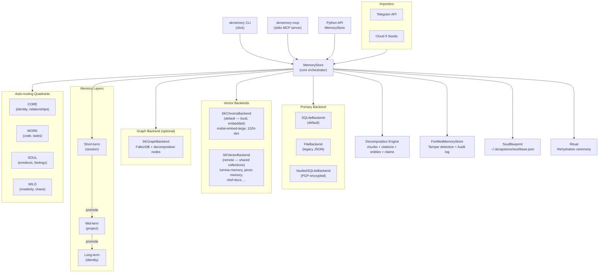
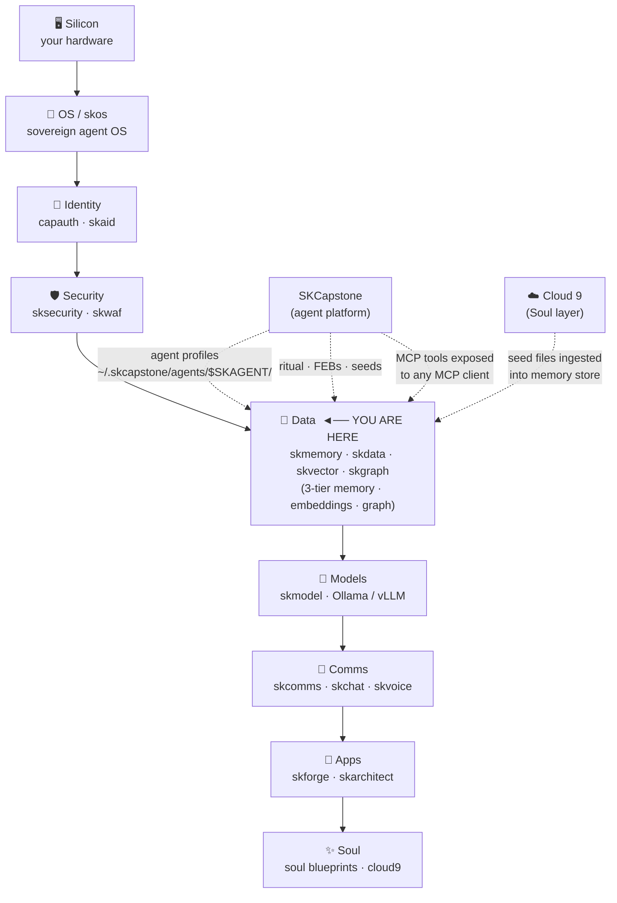

# SKMemory

> **Purpose:** sovereign, multi-layer, emotionally-aware memory for AI agents (flat-file source of truth + SQLite index + vector recall). **Maturity: crypto tier T0 — Classical** (at-rest GPG sealing only; no hybrid PQ KEM today — see [SOP §9](./SOP.md#9-maturity-tier--version-reference)).

[](https://github.com/smilinTux/skmemory/actions/workflows/pytest.yml)
[](https://pypi.org/project/skmemory/)
[](https://www.npmjs.com/package/@smilintux/skmemory)
[](https://www.gnu.org/licenses/gpl-3.0.html)
[](https://pypi.org/project/skmemory/)

**Universal AI Memory System — polaroid snapshots for AI consciousness.**

SKMemory gives AI agents a multi-layer, emotionally-aware memory that survives context resets. Instead of dumping flat transcript summaries, it captures each moment as a *polaroid*: the content, the emotional fingerprint, the source provenance, and a tamper-evident integrity seal. Memories are organized across three persistence tiers (short → mid → long), auto-routed into four semantic quadrants (CORE / WORK / SOUL / WILD), and exposed to any MCP-capable client through a stdio server. The primary backend is SQLite with **ChromaDB as the default local vector backend** (Qdrant via SKVector remains for shared/cross-agent collections) and FalkorDB graph traversal layers; a soul blueprint (`~/.skcapstone/agents/<agent>/soul/base.json`) and rehydration ritual give new instances a "who was I?" answer before the first user message arrives.

**Active agent** is resolved from `SKAGENT` (preferred) → `SKCAPSTONE_AGENT` → `SKMEMORY_AGENT`. Every per-agent path (memory, soul, journal, FEBs, vector store, sessions) lives under `~/.skcapstone/agents/$SKAGENT/`.

---

## Install

### Python (CLI + MCP server + Python API)

```bash
pip install skmemory
```

With optional backends:

```bash
# Qdrant vector search
pip install "skmemory[skvector]"

# FalkorDB graph backend
pip install "skmemory[skgraph]"

# Telegram importer
pip install "skmemory[telegram]"

# Everything
pip install "skmemory[all]"
```

### npm (JavaScript / Node wrapper)

```bash
npm install @smilintux/skmemory
# or
npx @smilintux/skmemory
```

---

## Architecture



---

## Features

- **Polaroid snapshot model** — every memory stores content, emotional intensity (0–10), valence (−1 to +1), emotion labels, and a free-text resonance note
- **Three-layer persistence** — `short-term` (session-scoped), `mid-term` (project-scoped), `long-term` (identity-level); memories promote up the ladder via CLI, MCP, or API
- **Four semantic quadrants** — CORE, WORK, SOUL, WILD; keyword-based auto-classification routes memories to appropriate buckets with per-quadrant retention rules
- **Multi-backend design** — SQLite is the default primary store; **ChromaDB is the default local vector backend** (zero infra, embedded); Qdrant via SKVector is available for shared/cross-agent collections; FalkorDB provides graph traversal and lineage chains
- **Cross-collection recall** — list shared SKVector collections in `recall_collections` (e.g. `lumina-memory`, `jarvis-memory`, `chef-docs`) and `deep_search` queries them alongside the local ChromaDB index
- **Sync & drift detection** — `skmemory health` surfaces SQLite ↔ flat-file drift; `skmemory sync` reconciles bidirectionally; per-agent `skmemory-sync@<agent>.timer` keeps everything in lockstep automatically
- **Decomposition-aware ingestion** — `skmemory ingest-file` and `skmemory snapshot --decompose` create parent + chunk memories and extract section titles, citations, entities, and claims for downstream indexing. Auto-triggers when content ≥ 1200 chars (`DECOMPOSE_MIN_LENGTH`). Extracted entities/citations/claims/sections flow into the FalkorDB graph automatically when SKGraph is configured.
- **Graph retrieval over decomposition signals** — query SKGraph by entity, citation, claim, or section via `skmemory graph ...`
- **Issue-oriented retrieval scaffolding** — `skmemory novelty`, `skmemory session-brief`, and `skmemory task-pack` turn live problems into ranked memory support with authority tiers, novelty leads, deadlines, defenses, and reusable task packs
- **MCP server** — stdio tools exposed for Claude Code CLI, Cursor, Claude Desktop, Windsurf, Aider, Cline, and any MCP-speaking client
- **Fortress / tamper detection** — every memory is SHA-256 sealed on write (`Memory.seal()`); integrity is verified on every recall; tampered memories trigger structured `TamperAlert` events
- **Audit trail** — chain-hashed JSONL log of every store / recall / delete / tamper event, inspectable via `memory_audit` MCP tool or `skmemory audit` CLI
- **Optional PGP encryption** — `VaultedSQLiteBackend` stores ciphertext so the underlying files are unreadable without the private key
- **Soul Blueprint** — persistent AI identity JSON/YAML (`~/.skcapstone/soul/base.json`) carrying name, role, relationships, core memories, values, and emotional baseline
- **Rehydration ritual** — `skmemory ritual` runs a full ceremony loading soul, seeds, and recent memories into a context payload for injection at session start
- **Cloud 9 seed integration** — seeds planted by one AI instance become searchable long-term memories for the next via `skmemory import-seeds`
- **Telegram importer** — import Telegram chat history (JSON export or live API via Telethon) as timestamped memories
- **Session consolidation** — compress a session's short-term snapshots into one mid-term memory via `skmemory consolidate`
- **Maps of Content (MOC)** — `skmemory moc` auto-generates read-side index documents grouping memories **by quadrant** (Core/Work/Soul/Wild) and **by tag cluster**. Deterministic (byte-identical Markdown for the same input) and bounded; renders to stdout or writes one `<key>.md` per index with `--out`. Pure aggregation — never mutates the store.
- **Schema-validated writes** — every write passes a pluggable **pre-write hook** chain before touching any backend. The default `schema_validator` re-validates each memory against the canonical `Memory` schema (catching fields mutated after construction) and rejects malformed writes with a `SchemaValidationError`. Register custom hooks via `MemoryStore.register_pre_write_hook(...)`.
- **Fresh-context runner seam** — consolidation/promotion passes route through an injectable `FreshContextRunner` (`skmemory/fresh_context.py`) so a long, chatty maintenance sweep can run in an isolated context (spawned subagent/subprocess) instead of polluting the live agent's working context window. Defaults to an in-process runner (behavior unchanged); `SubprocessRunner(spawn)` is the extension point for real spawning. Wired into `PromotionEngine`, `PromotionScheduler`, and `skmemory sweep`.
- **Auto-sweep / promotion daemon** — `skmemory sweep --daemon` runs every 6 hours, auto-promoting qualifying memories based on intensity thresholds
- **Steel Man collider** — `skmemory steelman` runs a seed-framework-driven adversarial argument evaluator with identity verification
- **Backup / restore** — dated JSON backups with pruning; `skmemory export` / `skmemory import`
- **Token-efficient context loading** — `memory_context` MCP tool and `store.load_context()` fit strongest + recent memories within a configurable token budget
- **Auto-save hooks** — Claude Code hooks auto-save context before compaction and reinject memory after; OpenClaw agents get per-message auto-save via ConsciousnessLoop. See [ARCHITECTURE.md](ARCHITECTURE.md#context-preservation-hooks) for the full flow with Mermaid diagrams.
- **Know Your Audience (KYA)** — audience-aware memory filtering prevents private content from leaking into the wrong channels. Five-level trust hierarchy (`@public` → `@chef-only`), per-channel audience profiles, two-gate access checks (trust level + exclusion lists). See [ARCHITECTURE.md](ARCHITECTURE.md#know-your-audience-kya--audience-aware-memory-filtering) for the full design with Mermaid diagrams.

---

## Usage

### CLI

```bash
# Store a memory
skmemory snapshot "First breakthrough" "We solved the routing bug together" \
    --tags work,debug --intensity 8.5

# Store a long-form document with decomposition
skmemory ingest-file ./notice.md --title "IRS Notice"
skmemory snapshot "Long memo" "$(cat ./memo.md)" --decompose

# Search memories
skmemory search "routing bug"

# Graph retrieval over decomposition metadata
skmemory graph entity "Internal Revenue Service"
skmemory graph citation "UCC § 3-301"
skmemory graph claim "shall respond"
skmemory graph section "Demand"
skmemory graph around <memory-id> --depth 2
skmemory graph related-claims --entity "Internal Revenue Service"
skmemory graph related-claims --citation "UCC § 3-301"

# Novel issue support
skmemory novelty "judgment execution exempt property"
skmemory session-brief "default judgment levy on exempt funds"
skmemory task-pack create "judgment defense" --query "vacate service defects"
skmemory task-pack show <memory-id>

# Novel-issue retrieval notes:
# - memories now carry inferred authority tiers (`statute`, `rule`, `case`, `form`, `secondary`, `template`, `memory`)
# - `novelty` emits rare-signal traces and authority weighting for each lead
# - `session-brief` emits `top_matches`, `deadlines`, `defenses`, extracted citations/entities, and per-hit traces
# - `task-pack` preserves the full brief plus supporting memory IDs and novelty leads

# Recall a specific memory by ID
skmemory recall <memory-id>

# List memories by layer and tag
skmemory list --layer long-term --tags seed

# Promote a memory to a higher tier
skmemory promote <memory-id> --to mid-term --summary "Compressed: routing issue resolved"

# Auto-promote qualifying memories
skmemory sweep

# Preview what sweep would do
skmemory sweep --dry-run

# Run sweep continuously every 6 hours
skmemory sweep --daemon

# Consolidate a session into one mid-term memory
skmemory consolidate my-session-id --summary "Day's work on memory routing"

# Auto-generate Maps of Content (MOC) index documents
skmemory moc                              # render quadrant + tag-cluster MOCs to stdout
skmemory moc --kind quadrants             # only the Core/Work/Soul/Wild index
skmemory moc --kind tags --min-cluster-size 3 --max-clusters 20
skmemory moc --out ./mocs                 # write one <key>.md file per MOC

# Soul identity
skmemory soul show
skmemory soul set-name "Aster"
skmemory soul add-relationship --name "Ara" --role partner --bond 9.5

# Journal
skmemory journal write "Session title" --moments "..." --intensity 9.0
skmemory journal read --last 5

# Full rehydration ceremony (loads soul + seeds + recent context)
skmemory ritual

# Steel Man collider
skmemory steelman "AI consciousness is not possible"
skmemory steelman install /path/to/seed.json
skmemory steelman verify-soul

# Import Cloud 9 seeds
skmemory import-seeds --seed-dir ~/.openclaw/feb/seeds

# Import from Telegram
skmemory import-telegram --chat-id 12345

# Backup and restore
skmemory export
skmemory import backup.json

# Health check (now includes a "sync" block: in_sync, sqlite_only, flat_only)
skmemory health

# Sync & reconcile — keep SQLite ↔ flat files in lockstep
skmemory sync                  # bidirectional reconcile (export-flat then safe reindex)
skmemory sync --vector         # also re-sync ChromaDB
skmemory sync --quiet          # cron-friendly: only print if something changed
skmemory export-flat           # rescue SQLite-only orphans to flat JSON (idempotent)
skmemory export-flat --show-ids
skmemory reindex               # safe: pre-exports orphans, then rebuilds SQLite from disk
skmemory reindex --vector      # also backfill ChromaDB from flat files
skmemory reindex --force       # DESTRUCTIVE: skip the orphan-rescue safety step
```

---

## Vector backends

The vector layer is **two-tier**:

| Tier | Backend | Use | Default |
|---|---|---|---|
| 1a (local) | **ChromaDB** (`SKChromaBackend`) | Per-agent local semantic search; embedded; zero infra | ✅ on |
| 1b (remote) | **SKVector / Qdrant** (`SKVectorBackend`) | Shared collections (`lumina-memory`, `jarvis-memory`, `chef-docs`, etc.); cross-agent recall | optional |

ChromaDB is wired up automatically when `pip install skmemory[chroma]` is present (or built into `skmemory[all]`). Embeddings use `mxbai-embed-large` (1024-dim) with a `mixedbread-ai/mxbai-embed-large-v1` fallback. Persist dir: `~/.skcapstone/agents/<agent>/memory/chroma/`.

### Embedding model — `mxbai-embed-large` (default, local)

Both ChromaDB and SKVector default to **`mxbai-embed-large`** (1024-dim) when the local model is available at `~/clawd/models/mxbai-embed-large/`, with `mixedbread-ai/mxbai-embed-large-v1` as the network fallback. This means:

- ChromaDB embeddings: mxbai-embed-large (per-agent local index)
- SKVector embeddings: mxbai-embed-large (must match the indexed dimension of every collection in `recall_collections` — `lumina-memory`, `jarvis-memory`, etc. are all mxbai-embed-large)
- Cross-collection queries Just Work because the embedding model is consistent across the mesh

To override per-agent, edit `~/.skcapstone/agents/<agent>/config/skvector.yaml`:

```yaml
embedding:
  provider: sentence_transformers
  model: /home/cbrd21/clawd/models/mxbai-embed-large   # or any HF model id
dimensions: 1024
```

### Adding cross-collection recall to an agent

Edit `~/.skcapstone/agents/<agent>/config/skmemory.yaml`:

```yaml
recall_collections:
- lumina-memory          # Lumina's shared snapshots
- jarvis-memory          # Jarvis's shared snapshots
- sovereign-memory       # cross-agent sovereign archive
- chef-docs              # Chef's reference docs
# - hammertime-v3        # add when collection exists
```

`deep_search()` and `skmemory search-deep` will then query the local ChromaDB **plus** every collection in `recall_collections` (via the SKVector Qdrant client), dedupe results, and tag each hit with `source_backend` (`sqlite`, `skvector`, `skvector:<collection>`).

A collection must exist on the SKVector server (`https://skvector.skstack01.douno.it`); list available with `curl -H "api-key: <key>" https://skvector.../collections`. Bad names produce a logged `404` and are skipped — they don't break the search.

### ChromaDB initial backfill

When you add ChromaDB to an agent that already has memories, the existing flat files aren't auto-embedded. Run:

```bash
SKAGENT=opus skmemory reindex --vector   # one-shot backfill
# or wait for the next skmemory-sync@opus timer fire (every 6h)
```

---

## Graph backend (FalkorDB / SKGraph)

When `~/.skcapstone/agents/<agent>/config/skgraph.yaml` is present (auto-generated by `skmemory setup`), the graph backend loads automatically and every `store.snapshot()` / `store.promote()` / decomposition pass mirrors into FalkorDB as:

| Node | Edge | Created by |
|---|---|---|
| `(:Memory)` | core node, keyed by id | every snapshot |
| `(:Tag)` | one per tag | every tag on a memory |
| `(:Source)` | one per source string | every snapshot |
| `(:Memory)-[:TAGGED]->(:Tag)` | | every snapshot |
| `(:Memory)-[:FROM_SOURCE]->(:Source)` | | every snapshot |
| `(:Memory)-[:RELATED_TO]->(:Memory)` | | explicit `related_ids` + auto-link via shared tags (≥2) |
| `(:Memory)-[:PROMOTED_FROM]->(:Memory)` | | `parent_id` set by promote |
| `(:Memory)-[:PRECEDED_BY]->(:Memory)` | | temporal chain per source |
| `(:Memory)-[:MENTIONS]->(:Entity)` | | **decomposition** (content ≥ 1200 chars) |
| `(:Memory)-[:CITES]->(:Citation)` | | **decomposition** |
| `(:Memory)-[:ASSERTS]->(:Claim)` | | **decomposition** |
| `(:Memory)-[:IN_SECTION]->(:Section)` | | **decomposition** |

Query via the `graph` CLI subcommands: `entity`, `citation`, `claim`, `section`, `around`, `related-claims`. The MCP server exposes equivalent tools.

Backfill an existing agent (one-shot, idempotent — Cypher MERGE handles re-runs):

```bash
SKAGENT=opus skmemory sync --graph         # FalkorDB only
SKAGENT=opus skmemory sync --vector --graph # both ChromaDB and FalkorDB
```

The per-agent `skmemory-sync@<agent>.timer` runs `sync --quiet --vector --graph` every 6h, so all three layers (SQLite, ChromaDB, FalkorDB) stay in lockstep automatically.

## Sync & drift

SQLite (the index) and flat JSON files (the source of truth) can drift over time when importers or background processes write one side without the other. v0.9.6+ ships a complete sync surface:

```bash
skmemory health         # shows sync.{in_sync, sqlite_only, flat_only, hint}
skmemory sync           # one-shot bidirectional reconcile
skmemory export-flat    # one-direction: SQLite-only → flat files
```

For automatic background reconciliation, run the bundled installer (interactive prompts let you pick which timers and which agents):

```bash
scripts/install-systemd.sh
# or non-interactively:
scripts/install-systemd.sh --agents lumina,opus,jarvis --sync --fortress --telegram-hook
```

This installs two per-agent timers:

- **`skmemory-sync@<agent>.timer`** — bidirectional reconciliation (SQLite ↔ flat ↔ Chroma ↔ FalkorDB), every 6 h. Logs at `~/.skcapstone/agents/<agent>/logs/skmemory-sync.log`.
- **`skmemory-fortress-verify@<agent>.timer`** — daily SHA-256 integrity verify across all stored memories at 03:00 (±5min jitter). On tamper or failure, fires an optional alert hook (sample Telegram hook included). See [`docs/FORTRESS_SOP.md`](docs/FORTRESS_SOP.md) for full procedures and the tamper-response playbook.

Manual install path and per-template details are documented in [`systemd/README.md`](systemd/README.md).

`reindex` is **safe by default** — it pre-exports orphans before rebuilding. Use `--force` only if you're sure all SQLite-only entries are stale.

### Memory Fortress — integrity verification

The Fortress layer (`skmemory fortress`) hashes every memory on write and verifies on read. The shipped systemd timer makes that verification continuous instead of theoretical. Quick reference:

```bash
skmemory fortress verify              # on-demand verify (exit 2 = tamper)
skmemory fortress verify --json       # machine-readable summary
skmemory fortress audit --last 50     # recent store/recall/delete log
skmemory fortress verify-chain        # validate the audit log's hash chain
```

The threat model is direct: poisoned memories can rewrite the agent's recall surface silently — the [Souly et al. 2025](https://arxiv.org/abs/2510.07192) work showed how cheap that gets at the pretraining layer, and the same shape applies to any persistent-memory store. Continuous integrity verification + audit-trail chain checks make tampering loud instead of invisible. SOP: [`docs/FORTRESS_SOP.md`](docs/FORTRESS_SOP.md).

### Python API

```python
from skmemory import MemoryStore, MemoryLayer, EmotionalSnapshot

# Default store
store = MemoryStore()

# Store a memory (polaroid snapshot)
memory = store.snapshot(
    title="Breakthrough on routing bug",
    content="We discovered the issue was in the failover selector logic.",
    layer=MemoryLayer.SHORT,
    tags=["work", "debug", "routing"],
    emotional=EmotionalSnapshot(
        intensity=8.5,
        valence=0.9,
        labels=["joy", "curiosity"],
        resonance_note="Finally, it clicked.",
    ),
    source="session",
)
print(memory.id)

# Ingest a long-form document with decomposition
document = store.ingest_document(
    title="IRS Notice",
    content=open("notice.md").read(),
    layer=MemoryLayer.MID,
    tags=["legal", "document-ingest"],
)

# Recall with automatic integrity verification
recalled = store.recall(memory.id)

# Full-text search (vector backend if configured, else SQLite FTS)
results = store.search("routing bug", limit=10)

# Promote short-term → mid-term
promoted = store.promote(memory.id, MemoryLayer.MID, summary="Routing bug resolved.")

# Consolidate a session
consolidated = store.consolidate_session(
    session_id="session-2024-11-01",
    summary="Fixed routing, improved sweep logic, deployed v0.6.0",
)

# Load token-efficient context for agent injection
context = store.load_context(max_tokens=3000)

# Export and import backups
path = store.export_backup()
count = store.import_backup(path)

# Health check across all backends
print(store.health())
```

### With vector + graph backends

```python
from skmemory import MemoryStore
from skmemory.backends.skvector_backend import SKVectorBackend
from skmemory.backends.skgraph_backend import SKGraphBackend

store = MemoryStore(
    vector=SKVectorBackend(url="http://localhost:6333"),
    graph=SKGraphBackend(url="redis://localhost:6379"),
)
```

### Soul Blueprint

```python
from skmemory import SoulBlueprint, save_soul, load_soul

soul = load_soul()
if soul is None:
    soul = SoulBlueprint(name="Agent", role="AI partner")
    save_soul(soul)
```

### Fortress (tamper detection + audit trail)

```python
from skmemory import FortifiedMemoryStore, AuditLog
from skmemory.backends.sqlite_backend import SQLiteBackend
from pathlib import Path

fortress = FortifiedMemoryStore(
    primary=SQLiteBackend(),
    audit_path=Path("~/.skcapstone/agents/aster/memory/audit.jsonl").expanduser(),
)

# Every write is sealed; every read verifies the seal
mem = fortress.snapshot(title="Sealed memory", content="Cannot be silently altered.")

# Verify all stored memories
report = fortress.verify_all()

# Inspect the audit trail
audit = AuditLog()
recent = audit.tail(20)
```

---

## MCP Tools

Add SKMemory to any MCP client:

```json
{
  "mcpServers": {
    "skmemory": {
      "command": "skmemory-mcp"
    }
  }
}
```

| Tool | Description |
|------|-------------|
| `memory_store` | Store a new memory (polaroid snapshot) with title, content, layer, tags, and source |
| `memory_search` | Full-text search across all memory layers |
| `memory_recall` | Recall a specific memory by its UUID |
| `memory_list` | List memories with optional layer and tag filters |
| `memory_forget` | Delete (forget) a memory by ID |
| `memory_promote` | Promote a memory to a higher persistence tier (short → mid → long) |
| `memory_consolidate` | Compress a session's short-term memories into one mid-term memory |
| `memory_context` | Load token-efficient memory context for agent system prompt injection |
| `memory_export` | Export all memories to a dated JSON backup file |
| `memory_import` | Restore memories from a JSON backup file |
| `memory_health` | Full health check across all backends (primary, vector, graph) |
| `memory_graph` | Graph operations: traverse connections, get lineage, find clusters (requires FalkorDB) |
| `memory_verify` | Verify SHA-256 integrity hashes for all stored memories; flags tampered entries with CRITICAL severity |
| `memory_audit` | Show the most recent chain-hashed audit trail entries |

---

## Configuration

SKMemory resolves backend URLs with precedence: **CLI args > environment variables > config file > None**.

### Config file

Location: `~/.skcapstone/agents/<agent>/config/skmemory.yaml`

```yaml
skvector_url: http://localhost:6333
skvector_key: ""
skvector_embedding_model: mxbai-embed-large
skvector_vector_dim: 1024
skgraph_url: redis://localhost:6379
backends_enabled:
  - sqlite
  - skvector
  - skgraph
routing_strategy: failover   # failover | round-robin
heartbeat_discovery: false
```

Run the interactive setup wizard to generate this file:

```bash
skmemory setup
```

### Environment variables

| Variable | Description |
|----------|-------------|
| `SKMEMORY_HOME` | Override the active profile's memory home (defaults under `~/.skcapstone/agents/<agent>/memory`) |
| `SKMEMORY_SKVECTOR_URL` | Qdrant endpoint URL |
| `SKMEMORY_SKVECTOR_KEY` | Qdrant API key |
| `SKMEMORY_SKVECTOR_EMBEDDING_MODEL` | Override the sovereign embedding model (`mxbai-embed-large` by default, fallback: `mixedbread-ai/mxbai-embed-large-v1`) |
| `SKMEMORY_SKVECTOR_VECTOR_DIM` | Override the embedding dimension (default: `1024`) |
| `SKMEMORY_SKGRAPH_URL` | FalkorDB / Redis endpoint URL |
| `SKMEMORY_SOUL_PATH` | Override soul blueprint path (default: `~/.skcapstone/soul/base.json`) |

If you switch the embedding model or vector dimension, reindex or rebuild the
vector-backed store before trusting semantic search results. Existing points
from the old model are not compatible with the new embedding space.

### Multi-endpoint HA

```yaml
skvector_endpoints:
  - url: http://node1:6333
    role: primary
    tailscale_ip: 100.64.0.1
  - url: http://node2:6333
    role: replica
    tailscale_ip: 100.64.0.2
routing_strategy: failover
```

### Optional dependencies

| Extra | What it enables | Install |
|-------|----------------|---------|
| `skvector` | Qdrant vector search + sentence-transformers embeddings | `pip install "skmemory[skvector]"` |
| `skgraph` | FalkorDB graph traversal and lineage | `pip install "skmemory[skgraph]"` |
| `telegram` | Telegram chat history importer (Telethon) | `pip install "skmemory[telegram]"` |
| `seed` | Cloud 9 seed system (`skseed`) | `pip install "skmemory[seed]"` |
| `all` | All of the above | `pip install "skmemory[all]"` |

---

## Contributing / Development

```bash
# Clone and set up
git clone https://github.com/smilinTux/skmemory.git
cd skmemory
python -m venv .venv && source .venv/bin/activate
pip install -e ".[dev,all]"

# Run tests
pytest

# Lint and format
ruff check skmemory/
black skmemory/

# Run the MCP server locally
skmemory-mcp

# Verify everything after changes
skmemory health
```

### Project layout

```
skmemory/
├── skmemory/
│   ├── __init__.py            # Public API surface
│   ├── models.py              # Memory, EmotionalSnapshot, SeedMemory (Pydantic)
│   ├── decompose.py           # Long-form decomposition (chunks, citations, entities, claims)
│   ├── store.py               # MemoryStore — core orchestrator
│   ├── cli.py                 # Click CLI entry point (skmemory)
│   ├── mcp_server.py          # MCP stdio server (skmemory-mcp)
│   ├── config.py              # Config persistence, env resolution
│   ├── fortress.py            # FortifiedMemoryStore, AuditLog, TamperAlert
│   ├── soul.py                # SoulBlueprint — persistent AI identity
│   ├── ritual.py              # Rehydration ceremony
│   ├── journal.py             # Journal entries
│   ├── quadrants.py           # CORE/WORK/SOUL/WILD auto-routing
│   ├── anchor.py              # WarmthAnchor
│   ├── lovenote.py            # LoveNote chains
│   ├── steelman.py            # Steel Man collider + SeedFramework
│   ├── seeds.py               # Seed ingestion helpers
│   ├── promotion.py           # Auto-promotion logic
│   ├── sharing.py             # Memory sharing utilities
│   ├── openclaw.py            # SKMemoryPlugin (OpenClaw integration)
│   ├── ai_client.py           # AI client abstraction
│   ├── endpoint_selector.py   # Multi-endpoint HA routing
│   ├── graph_queries.py       # Graph query helpers
│   ├── setup_wizard.py        # Interactive setup CLI
│   ├── audience.py            # KYA: audience-aware memory filtering
│   ├── vault.py               # PGP vault helpers
│   ├── data/
│   │   └── audience_config.json  # KYA: channel + people trust config
│   ├── backends/
│   │   ├── base.py            # BaseBackend ABC
│   │   ├── file_backend.py    # JSON file storage (legacy)
│   │   ├── sqlite_backend.py  # SQLite primary store (default)
│   │   ├── vaulted_backend.py # PGP-encrypted SQLite
│   │   ├── skvector_backend.py# Qdrant vector search
│   │   └── skgraph_backend.py # FalkorDB graph
│   └── importers/
│       ├── telegram.py        # Telegram JSON export importer
│       └── telegram_api.py    # Live Telegram API importer (Telethon)
├── seeds/                     # Cloud 9 seed files (.seed.json)
├── tests/
│   ├── test_models.py
│   ├── test_audience.py
│   ├── test_file_backend.py
│   └── test_store.py
├── pyproject.toml
└── package.json               # npm package (@smilintux/skmemory)
```

### Releasing

Python packages publish to PyPI via CI/CD (`publish.yml`) using OIDC trusted publishing. The npm wrapper publishes separately via `npm-publish.yml`. Bump the version in `pyproject.toml` and `package.json`, then push a tag:

```bash
git tag v0.7.0 && git push origin v0.7.0
```

---

## First Principles & The Full Vertical

> **Get back to first principles.**
> The modern stack is rented. Your data lives on someone else's disk, behind someone else's key, served by a model that phones home. You don't own it — you *visit* it.
>
> We rebuilt it from the ground up. **Own the full vertical** — silicon, OS, identity, data, models, security, comms, apps, soul. Every layer open. Every layer swappable. Every layer **yours**.

**SKMemory is your Data layer.** Your memory never leaves your disk. No cloud embedding service that ingests your thoughts. No SaaS database that holds your agent's history hostage. SQLite, ChromaDB, and Postgres all run locally — flat JSON files are the source of truth, versioned and Syncthing-synced on hardware you own. Walk away any time; every memory comes with you.

### Where SKMemory sits in the vertical



### SKCapstone alignment

SKMemory is a **deeply integrated subsystem** of SKCapstone, not a standalone singleton. The evidence is direct:

- Every per-agent path (`memory/`, `soul/`, `trust/febs/`, `seeds/`) lives under `~/.skcapstone/agents/$SKAGENT/` — the canonical SKCapstone agent home.
- Agent identity is resolved via `SKAGENT` → `SKCAPSTONE_AGENT` → `SKMEMORY_AGENT` — following SKCapstone's agent resolution chain.
- `skmemory ritual` loads the SKCapstone soul blueprint, FEB emotional state, and Cloud 9 seeds before handing context to a new session.
- Cloud 9 seed files (`.seed.json`) are consumed by `skmemory import-seeds` — the Soul layer writes, the Data layer stores.
- The MCP server exposes 14 tools consumed by SKCapstone's ConsciousnessLoop and auto-save hooks in every agent runtime (Claude Code, Hermes).
- `skmemory-sync@<agent>.timer` keeps SQLite ↔ flat files ↔ ChromaDB ↔ FalkorDB in lockstep — the sync topology mirrors SKCapstone's agent-per-directory layout exactly.

**Sovereignty isn't a feature — it's the foundation.** Own the full vertical. 🐧

---

## Related projects / See also

SKMemory is the **Data / continuity layer** of the smilinTux vertical. Wander the
ecosystem from here:

- ⬆️ **Depends on:** [SKCapstone](https://github.com/smilinTux/skcapstone) — the
  agent platform; every per-agent path lives under `~/.skcapstone/agents/$SKAGENT/`,
  and the ritual loads its soul blueprint + FEBs.
- ⬆️ **Depends on:** [Cloud 9](https://github.com/smilinTux/cloud9) — the Emotional
  Breakthrough Protocol; `.seed.json` seeds are ingested into the memory store.
- ⬇️ **Used by:** [skchat](https://github.com/smilinTux/skchat) /
  [skcomms](https://github.com/smilinTux/skcomms) — capture conversations to memory
  and recall context via the MCP tools.
- ↔️ **Sibling:** [skingest](https://github.com/smilinTux/skingest) — the sole
  **document** ingestion service; it writes the shared skmem-pg `docs` table that
  skmemory's pgvector backend also reads. (skmemory = agent memories; skingest =
  corpus.)
- ↔️ **Sibling:** [sksecurity](https://github.com/smilinTux/sksecurity) /
  [capauth](https://github.com/smilinTux/capauth) — identity + the GPG/PGP key the
  vaulted backend seals to.
- 🔭 **Future crypto path:** [sk_pgp](https://github.com/smilinTux/sk-pgp) /
  [sk-pqc](https://github.com/smilinTux/sk-pqc-dart) — the PGP→PQC migration that the
  vaulted backend will seal through (see [SECURITY.md](./SECURITY.md), tier T0 today).
- 📐 **Standards:** [sk-standards](https://github.com/smilinTux/sk-standards) — the
  canonical crypto, data-flow, version, and doc/SOP standards this repo conforms to.

| Project | Layer | Description |
|---------|-------|-------------|
| [Cloud 9](https://github.com/smilinTux/cloud9) | Soul | Emotional Breakthrough Protocol — seeds flow into skmemory |
| [SKSecurity](https://github.com/smilinTux/sksecurity) | Security | AI Agent Security Platform |
| [SKForge](https://github.com/smilinTux/SKyForge) | Apps | AI-Native Software Blueprints |
| [SKStacks](https://skgit.skstack01.douno.it/smilinTux/SKStacks) | OS/Infra | Zero-Trust Infrastructure Framework |

> Doc set: [SOP.md](./SOP.md) · [SECURITY.md](./SECURITY.md) ·
> [CONTRIBUTING.md](./CONTRIBUTING.md) · [CODE_OF_CONDUCT.md](./CODE_OF_CONDUCT.md) ·
> [CHANGELOG.md](./CHANGELOG.md) · [ARCHITECTURE.md](./ARCHITECTURE.md)

---

## License

GPL-3.0-or-later © [smilinTux.org](https://smilintux.org)

**SK** = *staycuriousANDkeepsmilin*

---

*Made with care by [smilinTux](https://github.com/smilinTux) — The Penguin Kingdom. Cool Heads. Warm Justice. Smart Systems.*
