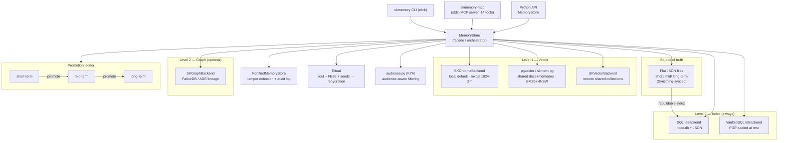

# SKMemory — Standard Operating Procedures

Sovereign, multi-layer, emotionally-aware memory for AI agents. Flat JSON files are
the **source of truth**; SQLite is the working index; ChromaDB (local default) and
pgvector/skmem-pg provide vector recall. Called by SKCapstone agents (Claude Code,
Hermes) over the CLI, the Python API, and the stdio MCP server.

> This SOP is the operational source of truth. Deeper design lives in
> [`ARCHITECTURE.md`](./ARCHITECTURE.md), the fortress/tamper model in
> [`docs/FORTRESS_SOP.md`](./docs/FORTRESS_SOP.md), provenance in
> [`docs/PROVENANCE_AND_CLOSURE_DESIGN.md`](./docs/PROVENANCE_AND_CLOSURE_DESIGN.md),
> and audience gating in [`docs/admission_policy.md`](./docs/admission_policy.md).

---

## 1. Overview

**Purpose.** Give an AI agent a memory that survives context resets: capture each
moment as a *polaroid* (content + emotional fingerprint + provenance + integrity
seal), organise it across three persistence tiers and four semantic quadrants, and
re-hydrate identity ("who was I?") before the first user message.

**What it owns.**
- The per-agent memory store under `~/.skcapstone/agents/$SKAGENT/memory/`.
- The flat-file ⇄ SQLite ⇄ vector sync topology.
- The rehydration ritual (soul blueprint + FEBs + seeds + strongest memories).
- The MCP tool surface consumed by every agent runtime.

**What it explicitly does NOT do.**
- It is **not** the ingestion service for external corpora — that is
  [skingest](https://github.com/smilinTux/skingest). skmemory stores *agent*
  memories; skingest ingests *documents* into the shared `docs` table.
- It does **not** run the embedding model — it calls an Ollama-compatible endpoint
  (`mxbai-embed-large`, 1024-dim).
- It does **not** manage the agent's identity keys — that is
  [capauth](https://github.com/smilinTux/capauth)/sksecurity. skmemory only *uses*
  a GPG key to seal the vaulted backend at rest.

---

## 2. Architecture



**Key invariant:** the flat JSON files are canonical. SQLite, ChromaDB, pgvector,
and the graph are all **derived projections** — delete any of them and rebuild from
the flat files (`skmemory health`, re-index scripts). No dual-master.

**Endpoints / paths.**
- Embed endpoint: Ollama-compatible, `mxbai-embed-large`, default
  `http://localhost:11434/api/embed`.
- skmem-pg DSN: default `localhost:5433` (the skmem-pg container); falls back to
  ChromaDB when unreachable (health-gated in `mcp_server.py`).
- Per-agent home: `~/.skcapstone/agents/$SKAGENT/` (`SKAGENT` → `SKCAPSTONE_AGENT`
  → `SKMEMORY_AGENT`, default `lumina`).

---

## 3. Build

```bash
git clone https://github.com/smilinTux/skmemory.git
cd skmemory
python -m venv .venv && source .venv/bin/activate
pip install -e ".[dev,all]"      # all = skvector, skgraph, telegram extras
```

Artifacts: Python wheel/sdist (`skmemory` on PyPI) + an npm wrapper
(`@smilintux/skmemory`). CI builds both on tag (`publish.yml`, `npm-publish.yml`).

---

## 4. Test

```bash
pytest                            # unit + backend tests (tests/)
ruff check skmemory/
skmemory health                   # end-to-end: flat ⇄ index ⇄ vector liveness
```

**Green-bar gate (blocks release):** `pytest` passes, `ruff` clean, and
`skmemory health` reports the backends it claims as live. Any LIVE/backend claim in
README/CHANGELOG must be reproducible from `skmemory health` output.

---

## 5. Release / Deploy

Library release (PyPI + npm):

1. Bump `version` in `pyproject.toml` **and** `package.json`.
2. Add a dated `CHANGELOG.md` entry (Keep-a-Changelog + SemVer).
3. Run the §4 gate.
4. `git tag vX.Y.Z && git push origin vX.Y.Z` — CI publishes to PyPI (OIDC trusted
   publishing) and npm.
5. Verify the published version installs and `skmemory health` is green.

Service deploy (per-agent sync): `skmemory-sync@<agent>.timer` (systemd, in
`systemd/`) keeps SQLite ⇄ flat files ⇄ vector in lockstep.

---

## 6. Configuration / Usage

- Agent resolution: `SKAGENT` (preferred) → `SKCAPSTONE_AGENT` → `SKMEMORY_AGENT`.
- Vector backend defaults: ChromaDB local; pgvector when `skmem-pg` is reachable.
- Config persisted via `config.py`; pg connection from `~/.config/skmemory/pg.env`.
- **Secret handling:** never inline a live secret. The vaulted backend seals memory
  at rest to the agent's GPG key (`vault.py`); the passphrase is supplied via
  gpg-agent, never stored in the repo or config. See [SECURITY.md](./SECURITY.md).

```bash
skmemory store "..." --layer long --emotion joy --intensity 8
skmemory search "cloud9 seeds"        # hybrid mxbai + BM25 (pgvector)
skmemory ritual                        # rehydrate identity
skmemory context --max-tokens 3000     # token-budgeted load for a new session
```

---

## 7. API / Reference

- **CLI:** `skmemory {store,search,context,ritual,promote,health,snapshot,songs,...}`.
- **MCP server:** `skmemory-mcp` (stdio) exposes 14 tools — `memory_store`,
  `memory_search`, `memory_recall`, `memory_context`, `memory_promote`,
  `memory_health`, `memory_save_session`, `memory_synthesize_*`, etc. (see the
  `mcp__skmemory__*` surface).
- **Python:** `from skmemory import MemoryStore` — `store.add()`, `store.search()`,
  `store.promote()`, `store.context()`.

Full tool/flag reference: [README.md](./README.md) §MCP Tools and §Usage.

---

## 8. Troubleshooting

| Symptom | Check |
|---|---|
| `search` returns nothing / falls back to SQLite | Is the embed endpoint up? `curl localhost:11434/api/embed`. Is skmem-pg reachable? `skmemory health`. |
| Vector results look domain-wrong | Confirm the query is embedded with **mxbai** (1024-dim), not a stale bge endpoint. |
| Rehydration ("ritual") empty | Soul blueprint missing at `~/.skcapstone/agents/$SKAGENT/soul/base.json`; seeds not imported (`skmemory import-seeds`). |
| Index drifts from flat files | Rebuild the index from the canonical flat files; check `skmemory-sync@<agent>` timer. |
| Vaulted backend can't read | gpg-agent not holding the passphrase; unlock then retry. |
| Wrong agent's memories | `SKAGENT`/`SKCAPSTONE_AGENT` not set as expected — echo it before launch. |

---

## 9. Maturity-tier + Version reference

- **Crypto maturity tier: T0 — Classical.** skmemory stores key material only in the
  sense of **sealing memory at rest** via the operator's GPG key
  (`VaultedSQLiteBackend`, `vault.py`) — classical OpenPGP (typically Ed25519/RSA +
  AES-256). It performs **no** key exchange, KEM, or signature negotiation of its
  own, so the agile/hybrid tiers (T1–T4) do not yet apply. A **hybrid PQ posture**
  (`HKDF(X25519 ‖ ML-KEM-768)`, FIPS 203) is **not** integrated today; the migration
  path is to seal via [sk_pgp](https://github.com/smilinTux/sk-pgp)/sk_pqc when the
  PGP→PQC root cutover lands. **No claim of post-quantum protection is made here.**
- **VERSION_LIFECYCLE phase:** Active. **SemVer:** see `pyproject.toml`
  (`0.10.x` at time of writing) and [CHANGELOG.md](./CHANGELOG.md).
- **Self-report / evidence:** `skmemory health` reports the live backends; the
  vaulted/fortress state is reported via the fortress audit log
  ([`docs/FORTRESS_SOP.md`](./docs/FORTRESS_SOP.md)). Every backend/LIVE claim in the
  docs is reproducible from that output (honest-claims gate, see
  [SECURITY.md](./SECURITY.md)).
</content>
</invoke>
