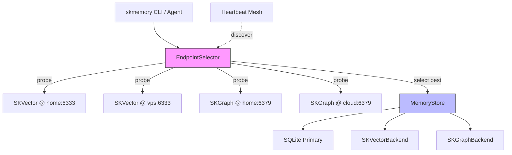
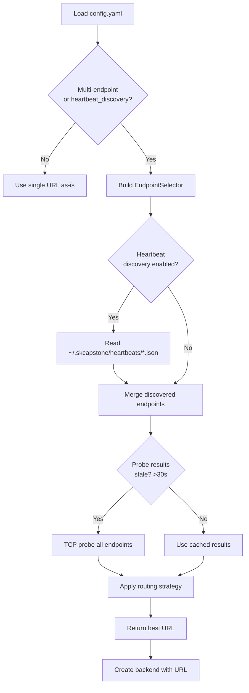
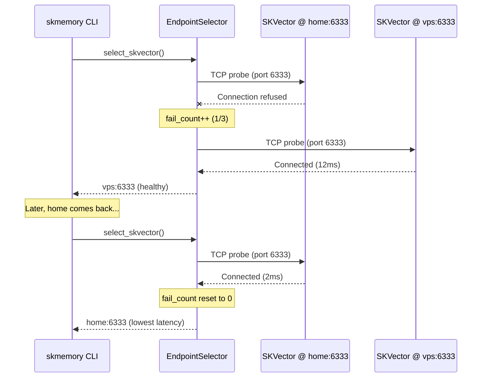
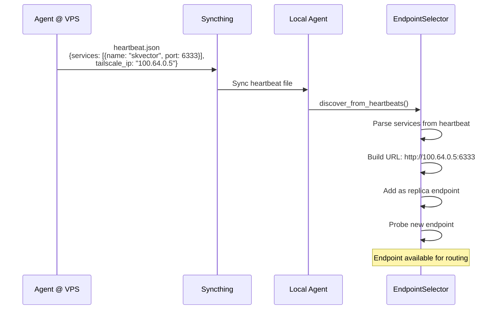

# SKMemory High Availability & Routing for SKVector and SKGraph Backends

> Self-contained endpoint routing for SKVector and SKGraph backends.
> No external load balancer. No new dependencies. Backward compatible.

> ### ⚠️ Scope: this applies ONLY to the retired SKVector/SKGraph recall endpoints
> The `primary`/`replica`/`failover` endpoint selector documented here covers the
> optional, **retired** shared recall backends (**SKVector/Qdrant**, **SKGraph/FalkorDB**)
> only. **skmem-pg is never run primary/replica and has no failover.** skmem-pg is LOCAL
> and per-node: each node runs its OWN writable Postgres on `localhost:5432`, and its
> `memories`/`docs` indexes are derived caches rebuilt from source on that node (flat JSON
> via `reconcile.py`; git wiki via skingest). HA/DR for skmem-pg = node self-sufficiency +
> rebuild-from-source, not replication. Streaming replication (`.158 -> .41` standby on
> :5433) was abandoned because ParadeDB Community cannot serve `pg_search` reads in
> recovery (prb-6f069c5e; hardened in 0.11.3). Do not apply the selector below to the
> skmem-pg write path.

## Overview

SKMemory's SKVector and SKGraph backends can run on multiple nodes across a
Tailscale mesh (or any network). The **EndpointSelector** sits between config
resolution and backend construction: it discovers endpoints, probes their
latency, selects the fastest healthy one, and fails over automatically.

Key properties:
- **On-demand probing** with TTL cache (no background threads)
- **Config endpoints take precedence** over heartbeat discovery
- **Graceful degradation** — missing heartbeats, Tailscale, or config all fail silently
- **Backward compatible** — single `skvector_url` configs work unchanged

## Architecture

### Routing Layer Diagram



The selector picks a URL, then backends are created with that URL. Backend
internals are **never modified** — the selector is a pure URL resolver.

### Endpoint Selection Flowchart



### Failover Sequence



### Heartbeat Discovery Flow



## Routing Strategies

### `failover` (default)

The simplest strategy. Uses the first healthy endpoint in the list.
If it goes down, moves to the next one.

| Reads | Writes | Use Case |
|-------|--------|----------|
| First healthy | First healthy | Simple HA, single primary |

### `latency`

Always picks the endpoint with the lowest measured TCP latency.
Best for globally distributed agents where network proximity matters.

| Reads | Writes | Use Case |
|-------|--------|----------|
| Lowest latency healthy | Lowest latency healthy | Globally distributed agents |

### `local-first`

Prefers `localhost` / `127.0.0.1` if available, then falls back to
lowest latency. The most common strategy — agents that have a local
Docker stack should use it.

| Reads | Writes | Use Case |
|-------|--------|----------|
| localhost if available | localhost if available | Prefer local Docker stack |

### `read-local-write-primary`

Reads go to the closest healthy endpoint (local preference).
Writes go **only** to endpoints with `role: primary`.
Good for setups with one write primary and multiple read replicas.

| Reads | Writes | Use Case |
|-------|--------|----------|
| Lowest latency | Only `role=primary` | Eventual consistency OK |

## Configuration

### Single Node (backward compatible)

No changes needed. Old configs work as before:

```yaml
# ~/.skmemory/config.yaml
skvector_url: http://localhost:6333
skgraph_url: redis://localhost:6379
```

Or via environment variables:
```bash
export SKMEMORY_SKVECTOR_URL=http://localhost:6333
export SKMEMORY_SKGRAPH_URL=redis://localhost:6379
```

### Multi-Node (Tailscale mesh)

```yaml
# ~/.skmemory/config.yaml
skvector_endpoints:
  - url: http://localhost:6333
    role: primary
  - url: http://100.64.0.5:6333
    role: replica
    tailscale_ip: "100.64.0.5"

skgraph_endpoints:
  - url: redis://localhost:6379
    role: primary
  - url: redis://100.64.0.5:6379
    role: replica

routing_strategy: local-first
```

### Global Distribution

```yaml
# ~/.skmemory/config.yaml
skvector_endpoints:
  - url: https://us-east.qdrant.example.com:6333
    role: primary
  - url: https://eu-west.qdrant.example.com:6333
    role: replica
  - url: https://ap-south.qdrant.example.com:6333
    role: replica

routing_strategy: latency
```

### Heartbeat Auto-Discovery

Let agents find each other's backends via the heartbeat mesh:

```yaml
# ~/.skmemory/config.yaml
skvector_url: http://localhost:6333
routing_strategy: latency
heartbeat_discovery: true
```

Agents that run `skcapstone heartbeat pulse` will advertise any locally
detected services (SKVector on 6333, SKGraph on 6379). Other agents read
these heartbeats and add the endpoints automatically.

## CLI Commands

```bash
# Show endpoint rankings, latency, and health
skmemory routing status

# Force re-probe all endpoints
skmemory routing probe
```

## What We Built This For (Ideal Use Case)

A sovereign agent running on a home server with SKVector and SKGraph in Docker.
A second instance runs on a VPS. Both are connected via Tailscale. When the
home server goes down for maintenance, the agent on the VPS automatically
routes to its local SKVector instance (or another VPS peer). When the home
server comes back, agents detect the lower latency and route back.

No ops team. No service mesh. No external load balancer. Just config and
heartbeats.

## Pros & Challenges

### Strengths

- **Zero-downtime maintenance** — drain a node, agents auto-route elsewhere
- **Self-contained** — no external load balancer, service mesh, or ops team
- **Self-healing** — unhealthy endpoints auto-recover when they come back
- **Latency-optimized** — agents always use the closest backend
- **Backward compatible** — single URL configs work unchanged
- **No new dependencies** — stdlib `socket` for probing
- **Cross-platform** — works on Linux, macOS, Windows

### Challenges & Solutions

| Challenge | Solution | When It Matters |
|-----------|----------|----------------|
| Write consistency with multiple primaries | Use `read-local-write-primary` — one write endpoint | Multiple writers to same data |
| Stale reads from replicas | Acceptable for memory search (not bank transactions) | Real-time requirements |
| Probe overhead on CLI startup | Lazy probing with 30s cache — first call probes, subsequent use cache | High-frequency CLI usage |
| Heartbeat directory not available | Graceful fallback to config-only endpoints | skcapstone not installed |
| Tailscale IP detection fails | Falls back to hostname | Non-Tailscale deployments |
| Large number of endpoints (50+) | Probe only top-N by last known latency | Enterprise scale |

### What This Doesn't Solve

- **Cross-region write replication** — Use Qdrant distributed mode or external replication
- **Strong consistency** — This is eventual consistency; fine for AI memory, not for transactions
- **Automatic replica provisioning** — You still deploy Qdrant/FalkorDB manually; routing just finds them

## Future Scaling

### Qdrant Distributed Mode

For 10M+ memories, Qdrant's built-in sharding distributes data across nodes.
The endpoint selector would point to the Qdrant cluster entry point; Qdrant
handles internal routing.

### Redis Sentinel for FalkorDB

Redis Sentinel provides automatic primary election for FalkorDB. The selector
could query Sentinel for the current primary instead of probing directly.

### Write Consistency

For strong write consistency across regions:
1. Single-writer topology (one primary, N replicas)
2. Or write-ahead log that queues writes offline and syncs when primary recovers
3. Or Qdrant distributed mode which handles consensus internally

### Edge Caching

Read-heavy workloads could benefit from a local in-memory LRU cache that
sits in front of the selector, reducing probe frequency and backend load
for repeated queries.

## Cross-Platform Notes

- **TCP probing** uses Python's `socket.create_connection()` — works on all platforms
- **Tailscale IP detection** runs `tailscale status --json` — fails silently on Windows if not in PATH
- **Heartbeat files** use JSON on the filesystem — works everywhere Syncthing works
- **Config files** use standard YAML — no platform-specific paths beyond `~/.skmemory/`
